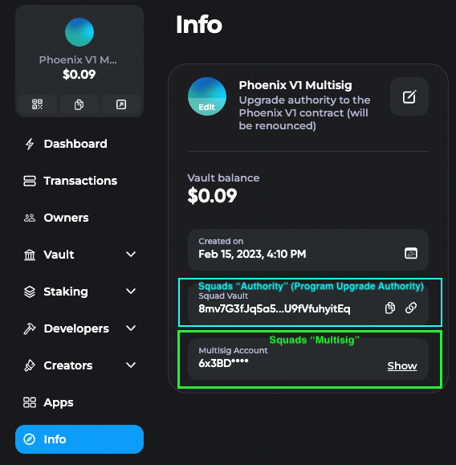

# squads-v3-onchain-index

A smart contract that allows users to directly associate program upgrade authority keys to the Squads V3 program.

## Problem

Today on Solana mainnet, it's essentially impossible to know how an on-chain program is being controlled and how the update authority is managed.

Program management generally falls into 3 categories:

1. Upgradeable by single hot wallet or ledger (👎)
2. Upgradeable by multisig via [Squads V3](https://github.com/Squads-Protocol/squads-mpl/tree/main/programs/squads-mpl) (👌)
3. Completely frozen (👍)

In practice, most protocol teams opt for the multisig approach because it's a reasonable tradeoff between security and control. However, it's extremely difficult to be able to know whether a program is in category 1 or 2.

## Solution

The `squads-v3-index` program allows anyone to permissionlessly create a link between program upgrade authorities and the Squads V3 program. After a program authority has been registered, it will be extremely easy for downstream applications to tie programs to Squads V3.

The program is deploy immutably to Solana mainnet at `idxqM2xnXsym7KL9YQmC8GG6TvdV9XxvHeMWdiswpwr`

To verify this program, run:

```bash
solana-verify verify-from-repo --remote -um --program-id idxqM2xnXsym7KL9YQmC8GG6TvdV9XxvHeMWdiswpwr --library-name squads_v3_index --mount-path squads-v3-index/ https://github.com/Ellipsis-Labs/squads-v3-onchain-index
```

## Installation

To install the CLI run:

```bash
cargo install squads-v3-index-cli
```

## Usage: Index

The easiest way to index a program is to directly pass in the program ID. The CLI will automatically add an index for the program upgrade authority.
**Note that the local keypair will need to pay 0.00089588 SOL for the transaction if the key is not already indexed.**

```bash
squads-v3-index-cli index $PROGRAM_ID
```

## Usage: Check

After execution you can run the `check` subcommand on the program ID to validate that the index has been created:

```bash
$ squads-v3-index-cli check $PROGRAM_ID
```

## Advanced Usage

If you want to index an arbitrary Squads Vault, you will first need to find the address of its corresponding the Multisig Account.

**Note that this is different from the Squads Vault authority**.

You can find both of these address in the **Info** section on the Squads V3 UI. The "Authority" (or Squad Vault) is highlighted in light blue and the "Multisig" is highlighted in lime green.

The Authority is the true program upgrade authority, but it is not possible to connect it back to the Squads V3 program. However, its address is deterministically derived from the Multisig, and it is possible to connect the Multisig back to the Squads V3 program.



Once you grab the Multisig address, pass it into the `index` subcommand on the CLI. It will print the following for you to confirm:

```bash
$ squads-v3-index-cli index 6x3BDkL2n7VjBWxRD95EsbQi2R2E4zxrvcz1VA6pihnK
3/4 Multisig account exists
Multisig key: 6x3BDkL2n7VjBWxRD95EsbQi2R2E4zxrvcz1VA6pihnK
Authority key: 8mv7G3fJq5a5ej7E14vgcSGeQKH79emjU9fVfuhyitEq

Executing instruction:

Instruction {
    program_id: idxqM2xnXsym7KL9YQmC8GG6TvdV9XxvHeMWdiswpwr,
    accounts: [
        AccountMeta {
            pubkey: 11111111111111111111111111111111,
            is_signer: false,
            is_writable: false,
        },
        AccountMeta {
            pubkey: 8mv7G3fJq5a5ej7E14vgcSGeQKH79emjU9fVfuhyitEq,
            is_signer: false,
            is_writable: false,
        },
        AccountMeta {
            pubkey: 6x3BDkL2n7VjBWxRD95EsbQi2R2E4zxrvcz1VA6pihnK,
            is_signer: false,
            is_writable: false,
        },
        AccountMeta {
            pubkey: 6rMVyqRBs8qL6GxXS8pHncGwhJP2FZWnjTVgwN2t3VfQ,
            is_signer: true,
            is_writable: true,
        },
        AccountMeta {
            pubkey: HwLnWCj5huUdzXnt2QmVUFrFcjZw7L7UJ1Paqz14q4zu,
            is_signer: false,
            is_writable: true,
        },
    ],
    data: [],
}

Cost: 0.00089588 SOL

(y/n)
```

If you don't want the confirmation you can pass in the `-y` flag to immediately execute.

After execution you can still run the `check` subcommand on the Squads Vault authority to validate that the index has been created:

```bash
$ squads-v3-index-cli check 8mv7G3fJq5a5ej7E14vgcSGeQKH79emjU9fVfuhyitEq
Index account exists for 8mv7G3fJq5a5ej7E14vgcSGeQKH79emjU9fVfuhyitEq ✅
```
